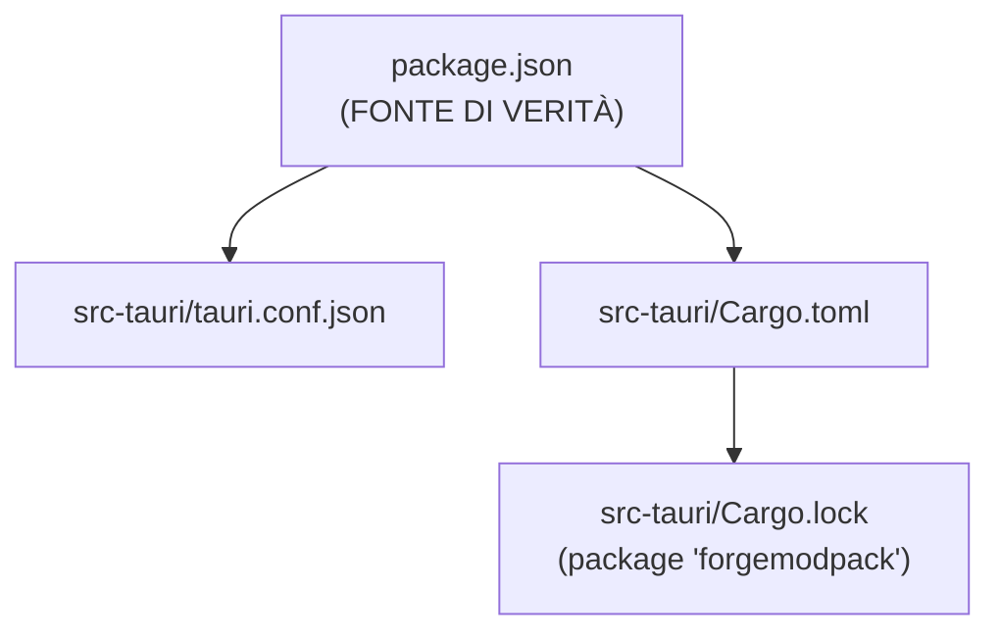
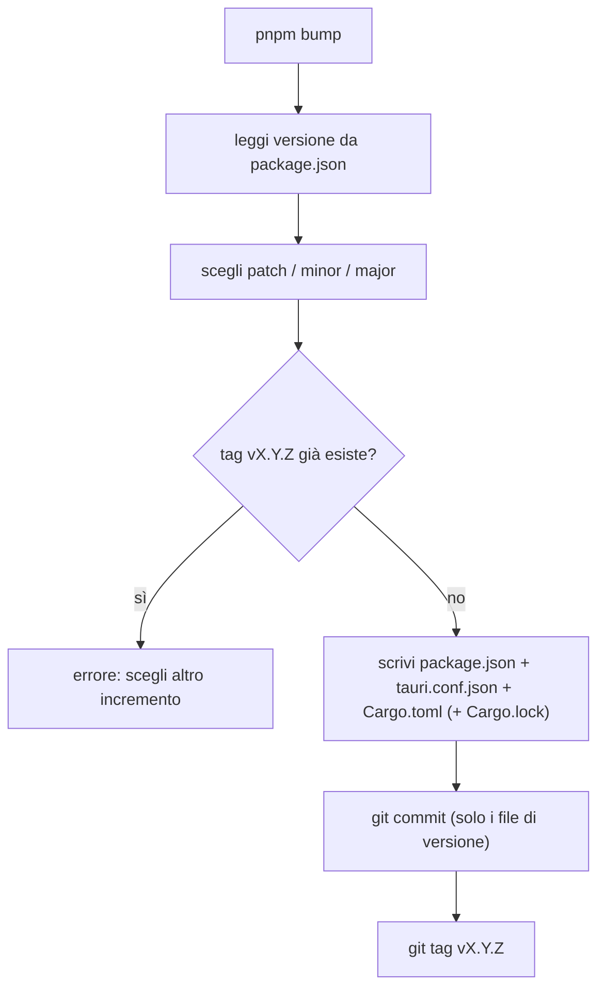
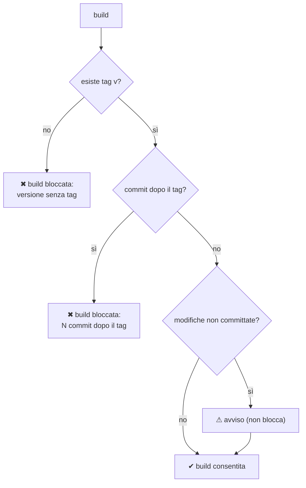
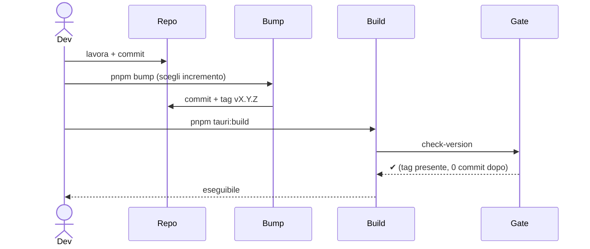

# 12 — Versioning e gate di build

La versione dell'app vive in **tre file** da tenere allineati; una build è **bloccata** finché la
versione corrente non è stata "generata di fresco" con `pnpm bump`.

## I tre file (+ lock)

## `pnpm bump` ([`bump-version.mjs`](../../../scripts/bump-version.mjs))

Bump interattivo che sincronizza tutti i file e crea commit + tag.

- `package.json` è la fonte di verità; deve essere semver `X.Y.Z`.
- Aggiorna: `package.json` e `tauri.conf.json` (JSON, indent 2), `Cargo.toml` (solo la prima riga
  `version = "..."`), `Cargo.lock` (versione del package `forgemodpack`, se il lock esiste).
- Crea commit (limitato ai file di versione) e tag `vX.Y.Z`. Fallisce se il tag esiste già.

## Gate di build ([`check-version.mjs`](../../../scripts/check-version.mjs))

Incatenato nel `beforeBuildCommand` di `tauri.conf.json` → vale sia per `pnpm tauri:build` sia per
`tauri build`.

Regole di blocco:
1. deve esistere il tag git `v<versione>` (creato da `pnpm bump`);
2. non ci devono essere commit **dopo** quel tag (altrimenti hai fatto lavoro nuovo senza bumpare →
   versione "stantia").

Le modifiche non committate producono solo un **avviso** (non bloccano).

## Flusso tipico di release

> In pratica: fai bump **subito prima** di ogni build. Qualsiasi commit successivo al tag richiede un
> nuovo bump prima di poter ribuildare.

## Check aggiornamenti ([`update-check.ts`](../../../src/lib/update-check.ts))

L'app **verifica** se esiste una versione più recente, ma **non si aggiorna da sola**: non usa
`tauri-plugin-updater`, quindi non serve né una chiave di firma né un `latest.json` da pubblicare.
Trovata una versione nuova si apre la pagina della release nel browser (`openUrl`) e l'utente scarica
l'installer a mano.

- **Sorgente**: `GET https://api.github.com/repos/Alexkill536ITA/ForgeModpack/releases?per_page=30`
  via `@tauri-apps/plugin-http`. **Non** `/releases/latest`, che ignora le pre-release: pubblicando
  beta la "latest" di GitHub resterebbe indietro (v1.1.0 e v1.2.0 sono pre-release, quindi per GitHub
  la latest è ancora v1.0.0). Il filtro sulle pre-release lo fa l'app. L'host
  `https://api.github.com/**` è whitelistato in
  [`capabilities/default.json`](../../../src-tauri/capabilities/default.json), e la richiesta manda un
  `User-Agent` esplicito: senza, l'API GitHub risponde **403** (il client HTTP di Tauri non ne manda
  uno di default).
- **Versione installata**: `getVersion()` di `@tauri-apps/api/app` (coperto da `core:default`), cioè
  la versione di `tauri.conf.json`. Nel solo `pnpm dev` (browser) non è disponibile e il check non parte.
- **Confronto**: `compareVersions` è un semver ridotto **puro** (core numerico + pre-release,
  metadati `+build` ignorati): serve perché il confronto fra stringhe sbaglia in silenzio
  (`"1.10.0" < "1.9.0"`). Un tag non versionato (`nightly`) vale 0, cioè "non lo so" → nessun
  aggiornamento proposto. `pickLatestRelease` scarta le bozze, filtra le pre-release secondo la
  preferenza e **non si fida dell'ordine dell'API**: confronta le versioni.
- **Preferenza pre-release**: `fmp.updates.includePrerelease` in `localStorage` (come la lingua: è una
  preferenza utente, non un dato del modpack). Default disattivata; la casella sta nel dialog e al
  cambio ri-esegue il check.

### UI ([`update-provider.tsx`](../../../src/providers/update-provider.tsx))

`UpdateProvider` (montato in [`layout.tsx`](../../../src/app/layout.tsx) dentro `ConfirmProvider`, così
avvolge la sidebar) tiene lo stato del controllo e rende il dialog; chi lo lancia usa
`useUpdateCheck()` → `{ checkNow, updateAvailable, latestVersion }`.

| Modalità | Innesco | Comportamento |
| --- | --- | --- |
| Automatica | mount del provider, una volta per avvio | Silenziosa: apre il dialog **solo** se c'è una versione nuova; un errore di rete resta nel `console.error` (l'app funziona offline) |
| Manuale | voce **Controlla aggiornamenti** nel menu della sidebar | Apre subito il dialog, che mostra anche "sei aggiornato" o l'errore |

Il check automatico è protetto da un ref per non chiamare l'API due volte in StrictMode (rate limit
GitHub: 60 richieste/ora per IP). Qui la guardia sta **prima** dell'`await` — al contrario di
[`mods-sync.ts`](../../../src/lib/mods-sync.ts) — perché non c'è lavoro da riprendere: l'unico scopo
è evitare la richiesta doppia. Quando un aggiornamento è disponibile, il trigger del menu mostra un
pallino e la voce di menu un badge con la versione. Non si usa il `BusyOverlay`: è una richiesta HTTP
leggera, non un'operazione bloccante.
