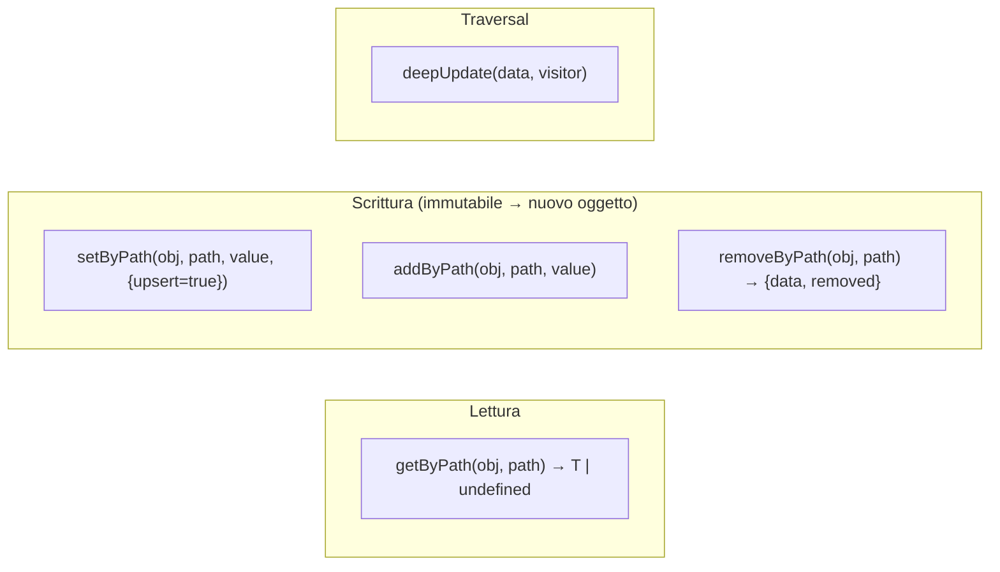

# 13 — Helper di libreria

Utility trasversali in [`src/lib/`](../../../src/lib). Le più importanti sono le funzioni di editing
immutabile del project (`json-data`), usate da (quasi) ogni pagina prima di `updateProject`.

## `json-data.ts` — editing immutabile del project

[`json-data.ts`](../../../src/lib/json-data.ts) espone `getByPath` / `setByPath` / `addByPath` /
`removeByPath` con **notazione a punti + bracket** e filtri. Tutte le funzioni di scrittura sono
**immutabili**: ritornano un nuovo oggetto (fondamentale per lo state React/Redux).

### Notazione dei path

| Path | Significato |
|------|-------------|
| `metadata.name` | chiave annidata |
| `mods[name=jei].version` | filtra `mods` per `name === "jei"`, poi legge/scrive `version` |
| `mods[name=jei]` | l'intero oggetto mod (o lo crea in upsert) |
| `keybindMaps[0].keybinds[0].key` | indice → chiave → indice → chiave |
| `configs.workpath` | chiave semplice |

Il parser (`parsePath`) produce segmenti `key` / `index` / `filter`.

### API

- **`getByPath<T>(obj, path)`**: walk di sola lettura; `undefined` se il path non esiste.
- **`setByPath<T>(obj, path, value, {upsert=true})`**: scrive/aggiorna. In **upsert** (default) crea
  i nodi intermedi mancanti (chiavi, indici, elementi filtrati); con `upsert:false` lancia errore se
  un nodo non esiste. Se il valore è un oggetto su un elemento filtrato, fa **merge** dei campi.
- **`addByPath<T>(obj, path, value)`**: append a un array individuato dal path.
- **`removeByPath<T>(obj, path)`**: rimuove chiave/indice/elemento filtrato; ritorna `{ data, removed }`.
- **`deepUpdate(data, visitor)`**: attraversamento ricorsivo con visitor (già immutabile).

> **Pattern centrale**: `const next = setByPath(project, "metadata.name", "X"); dispatch(updateProject(next))`.
> Usato ovunque, es. in `page.tsx` via `handleUpdateField`.

## `line-diff.ts` — diff per riga

[`line-diff.ts`](../../../src/lib/line-diff.ts) calcola il "dirty diff" tra contenuto su disco e contenuto
nell'editor (marcatori gutter Monaco + conteggi in status bar). Vedi [11 — Documents](./11-documents-editor.md).

- **`diffLines(original, current) → LineChange`**: LCS classico (DP `Uint32Array`) + backtracking,
  poi raggruppa le operazioni in blocchi `added` / `modified` / `deletedAt`.
- `LineChange`: `{ added[], modified[], deletedAt[], counts: {added, modified, removed} }`.
- Ottimizzazione: se `original === current` ritorna `EMPTY`; se `n*m > MAX_CELLS` (4M) rinuncia al
  dettaglio (ritorna `EMPTY`) per non pagare il costo O(n·m).

## `database.ts` — I/O file basilare

[`database.ts`](../../../src/lib/database.ts): `saveData(data, path, name)` (scrive un file accanto a
`path` con `../` + `name`) e `loadData(filePath)` (legge bytes). Wrapper sottili su `plugin-fs`.

## `monaco-setup.ts`

`setupMonacoLoader()` punta il loader di Monaco agli asset locali `/monaco/vs` (app offline).
Vedi [11 — Documents](./11-documents-editor.md).

## `utils.ts`

`cn(...inputs)`: merge di classi Tailwind (`clsx` + `tailwind-merge`). Convenzione shadcn/ui.

## Riepilogo dei moduli `lib/`

| Modulo | Ruolo | Doc |
|--------|-------|-----|
| `json-data.ts` | Editing immutabile del project | questo |
| `cache-db.ts` | Cache key-value SQLite | [07](./07-cache-manifest.md) |
| `manifest-cache.ts` | TTL + fallback offline | [07](./07-cache-manifest.md) |
| `get-manifest.ts` | Fetch manifest remoti | [07](./07-cache-manifest.md) |
| `mods-scan.ts` | Scansione mod (cache) | [06](./06-scansione.md) |
| `keybind-cache.ts` | Azioni keybind per mod + risoluzione mirata | [06](./06-scansione.md) |
| `datapacks-scan.ts` | Scansione datapack (cache) | [06](./06-scansione.md) |
| `keyboard-layout.ts` | Layout tastiera data-driven | [08](./08-keybinds.md) |
| `keybind-template.ts` | Template mappe + azioni vanilla | [08](./08-keybinds.md) |
| `keybind-export/` | Export verso file config | [09](./09-keybind-io.md) |
| `keybind-import/` | Import da file config | [09](./09-keybind-io.md) |
| `mc-keycodes.ts` | Tasto ↔ input code Minecraft | [09](./09-keybind-io.md) |
| `jvm.ts` | Flag JVM | [10](./10-jvm.md) |
| `file-language.ts` | Linguaggio Monaco da estensione | [11](./11-documents-editor.md) |
| `line-diff.ts` | Diff per riga | questo |
| `database.ts` / `utils.ts` / `monaco-setup.ts` | Utility | questo |
