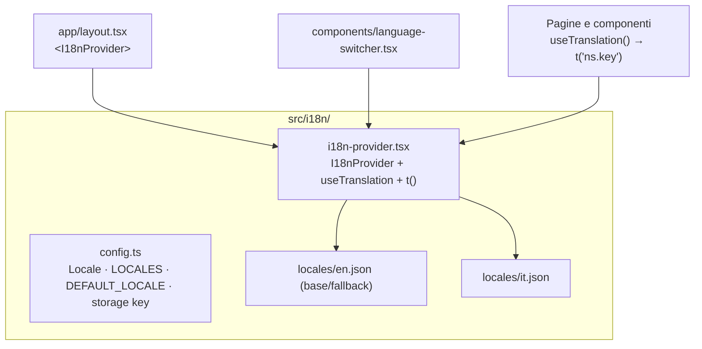
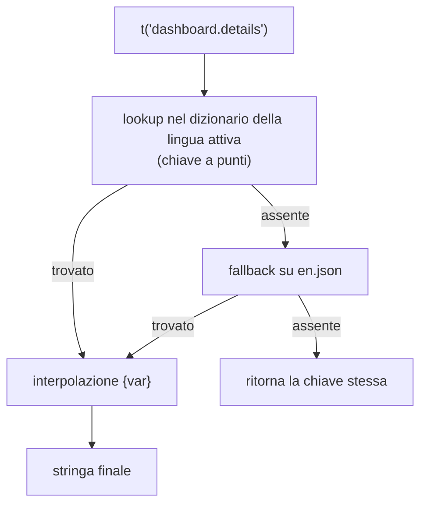
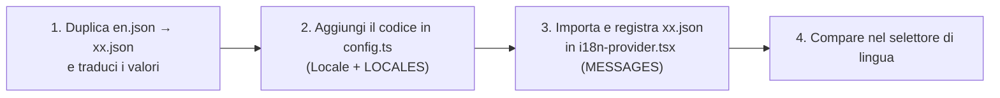

# 14 — Internazionalizzazione (i18n)

L'app è internazionalizzata con un sistema **custom leggero** (nessuna dipendenza esterna):
Context React + dizionari JSON per lingua + un hook `t()`. L'**inglese** è la lingua base/fallback;
l'**italiano** è la prima traduzione. La lingua è una preferenza dell'utente, persistita localmente.

## Architettura

| File | Ruolo |
|------|-------|
| [`config.ts`](../../../src/i18n/config.ts) | Tipo `Locale` (`"en" \| "it"`), elenco `LOCALES`, `DEFAULT_LOCALE`, `LOCALE_STORAGE_KEY`, guard `isLocale` |
| [`i18n-provider.tsx`](../../../src/i18n/i18n-provider.tsx) | `I18nProvider` (context), hook `useTranslation()`, funzione `t()` |
| [`locales/en.json`](../../../src/i18n/locales/en.json) | Dizionario inglese (base) |
| [`locales/it.json`](../../../src/i18n/locales/it.json) | Dizionario italiano |
| [`language-switcher.tsx`](../../../src/components/language-switcher.tsx) | Selettore di lingua (nell'header) |

## Il provider e l'hook

`I18nProvider` (montato in [`layout.tsx`](../../../src/app/layout.tsx) dentro `ReduxProvider`) tiene la
lingua corrente in stato React:

- Parte sempre da `DEFAULT_LOCALE` per evitare mismatch di hydration (SSG), poi al mount legge la
  preferenza salvata da `localStorage` (`fmp.locale`).
- `setLocale(next)` aggiorna lo stato e persiste la scelta.
- Un `useEffect` allinea `document.documentElement.lang` alla lingua attiva.

`useTranslation()` ritorna `{ locale, setLocale, t }`.

## La funzione `t(key, vars?)`

- **Chiave a punti**: `t("namespace.chiave")` naviga il JSON annidato.
- **Fallback**: lingua attiva → inglese → la chiave stessa (così una chiave mancante è visibile ma
  non rompe la UI).
- **Interpolazione**: segnaposto `{nome}` sostituiti dai valori passati, es.
  `t("documents.saved", { name: file })` con valore `"Saved {name}"`.

> ⚠️ `t` deriva da un hook: va chiamato **dentro** un componente React (o un altro hook), mai a
> livello di modulo. Per gli oggetti-etichetta a livello modulo (es. mapping motivo→testo) si mappa
> a una **sotto-chiave** e si risolve al punto d'uso: `t("keybinds.reason." + reason)`.

## Namespace

Le stringhe sono organizzate per area (namespace di primo livello del JSON):

| Namespace | Area |
|-----------|------|
| `common` | Etichette condivise (save, cancel, add…) |
| `language`, `header` | Selettore lingua, header |
| `dashboard` | Home / dati del modpack |
| `listmods` | List Mods |
| `keybinds` | Editor keybind (+ `keybinds.reason`, `keybinds.modifier`, `keybinds.importReport`) |
| `keybindIo` | Dialog import/export keybind |
| `jvm` | Pagina JVM |
| `documents` | Editor documenti |
| `analytics` | Pagina analytics |
| `sidebar`, `saveBar`, `projectGate`, `files`, `fileTree`, `confirm` | Sidebar, save bar, guardia progetto, albero file, dialog di conferma |

I due dizionari hanno **parità di chiavi** (stesse chiavi in EN e IT).

## Strategia dati persistiti vs UI

Nodo cruciale: alcune stringhe **user-facing** sono anche **dati salvati** nel `project.json`. La
regola è: **il valore persistito resta in inglese canonico**; la traduzione avviene solo in
**visualizzazione**. Così cambiare lingua non altera i progetti salvati né i match con l'export
Minecraft.

| Stringa | Trattamento |
|---------|-------------|
| Tag di default ([`keybind-template.ts`](../../../src/lib/keybind-template.ts) `TAG`) | Valori canonici in inglese, salvati in `project.keybindTags` |
| Categoria `"Vanilla"`, label azioni vanilla | Valori canonici inglesi (usati anche dall'export) |
| Tipi di asset (`ASSET_TYPES`) | Valori canonici inglesi salvati in `asset.type` |
| Label dei tasti ([`keyboard-layout.ts`](../../../src/lib/keyboard-layout.ts)) | Pure UI (non persistite): in inglese; non ancora localizzate per singolo tasto |

> Le stringhe **puramente di UI** (titoli, pulsanti, placeholder, toast, messaggi) sono invece
> localizzate via `t()`.

## Cosa NON è localizzato (per scelta)

- I **warning degli exporter** in [`keybind-export/`](../../../src/lib/keybind-export) (funzioni
  pure, senza accesso all'hook): restano in inglese.
- I nomi tecnici: label GC (`G1GC (Aikar)`, `ZGC`, `Shenandoah`), flag JVM generati, linguaggio del
  file nell'editor (deriva dall'estensione), nomi di comando/cartella, filtri dei dialog Tauri.
- I `console.error`/log (non user-facing).
- Il brand "Forge Modpack" e il copyright.

## Aggiungere una nuova lingua

1. Copia `en.json` in `locales/<codice>.json` e traduci i valori (mantenendo le stesse chiavi).
2. Aggiungi il codice al tipo `Locale` e all'array `LOCALES` in `config.ts`.
3. Importa il file e aggiungilo alla mappa `MESSAGES` in `i18n-provider.tsx`.

Il selettore ([`language-switcher.tsx`](../../../src/components/language-switcher.tsx)) mostra
automaticamente tutte le voci di `LOCALES`.
