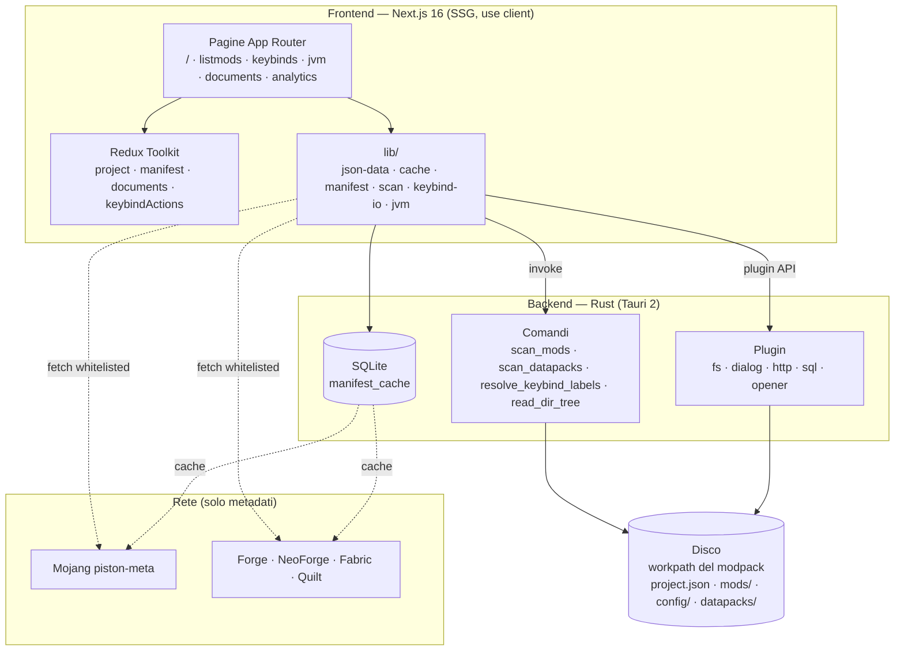

# ForgeModpack V2 — Documentazione

Documentazione tecnica dell'applicazione desktop **ForgeModpack V2**: un manager/editor
delle dipendenze e delle configurazioni di un modpack Minecraft (Tauri 2 + Next.js 16).

> **Cos'è (e cosa NON è)**: l'app legge la directory di un modpack **già esistente** sul
> disco, ne interpreta mod, datapack e configurazioni e — solo se serve — scarica online i
> metadati delle versioni (MC + modloader). **Non scarica i mod** e **non avvia Minecraft**:
> è un editor di configurazione, non un launcher.

## Indice

| # | Documento | Contenuto |
|---|-----------|-----------|
| 00 | [Panoramica](./00-panoramica.md) | Obiettivo, stack tecnologico, comandi, glossario |
| 01 | [Architettura](./01-architettura.md) | Diagramma dei layer, flusso dati, boundary Rust↔JS |
| 02 | [Modello dati](./02-modello-dati.md) | Il file `project.json`, tutti i tipi, diagramma delle entità |
| 03 | [Frontend — Pagine e navigazione](./03-frontend-pagine.md) | Le 6 route, ProjectGate, SaveBar, sidebar |
| 04 | [State globale (Redux)](./04-state-redux.md) | Gli slice, azioni, shape dello state |
| 05 | [Backend Rust](./05-backend-rust.md) | Comandi Tauri, plugin, migration SQLite |
| 06 | [Scansione mod, datapack e keybind](./06-scansione.md) | `scan_mods`, JarJar, riconoscimento keybind |
| 07 | [Cache SQLite e manifest remoti](./07-cache-manifest.md) | manifest MC/modloader, TTL, cache scansioni |
| 08 | [Keybinds](./08-keybinds.md) | Tastiera grafica, multi-mappa, categorie/tag, macro |
| 09 | [Import / Export keybind](./09-keybind-io.md) | `options.txt`, keyset, merge conservativo |
| 10 | [JVM](./10-jvm.md) | Allocazione RAM + garbage collector (flag Aikar) |
| 11 | [Documents — Editor di codice](./11-documents-editor.md) | Monaco offline, file tree, linguaggi |
| 12 | [Versioning e gate di build](./12-versioning-build.md) | `pnpm bump`, `check-version`, i tre file allineati |
| 13 | [Helper di libreria](./13-helper-lib.md) | `json-data` (getByPath/setByPath), utility varie |
| 14 | [Internazionalizzazione (i18n)](./14-i18n.md) | Provider + `t()`, dizionari JSON, strategia dati/UI, aggiungere una lingua |

## Mappa ad alto livello

## Convenzioni della documentazione

- I diagrammi usano **Mermaid** (renderizzati nativamente da GitHub e da molti editor Markdown).
- I riferimenti al codice puntano a `file:riga` dove utile.
- Testi UI in inglese, documentazione e commenti in italiano (come da convenzione di progetto).
