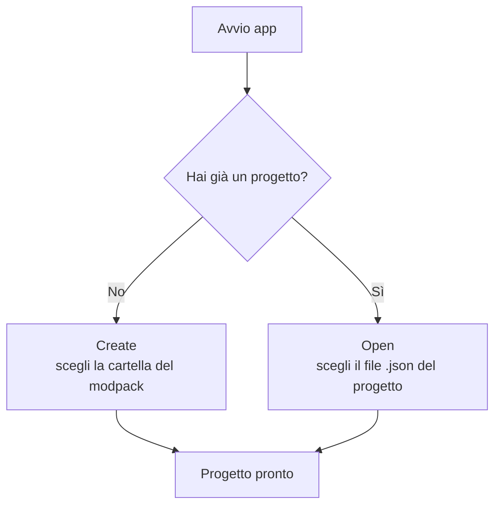

# 1 — Primi passi

## Cosa ti serve

- Un modpack **già presente sul disco**: una cartella che contiene almeno la sottocartella `mods`
  (e, se usi i datapack, una cartella dei datapack).
- L'app non installa né scarica mod: lavora su ciò che hai già.

## La cartella di lavoro (workpath)

La **cartella di lavoro** è la directory principale del tuo modpack. L'app la usa come punto di
riferimento per trovare `mods`, `config`, `kubejs`, i datapack e per salvare il file di progetto.

Struttura tipica:

```
📁 IlMioModpack/           ← cartella di lavoro (workpath)
├── 📁 mods/               ← i file .jar delle mod
├── 📁 config/             ← configurazioni delle mod
├── 📁 kubejs/             ← script KubeJS (se presenti)
├── 📁 datapacks/          ← datapack (se usati)
└── 📄 IlMioModpack.json   ← il file di progetto creato dall'app
```

## Creare o aprire un progetto

All'avvio, se non c'è un progetto aperto, l'app mostra due pulsanti:



- **Create** — Crea un nuovo progetto: scegli la cartella del modpack. L'app parte con impostazioni
  di base (modloader Forge, nessuna mod ancora elencata) che potrai cambiare subito dalla Dashboard.
- **Open** — Apri un progetto esistente: scegli il file `.json` salvato in precedenza.

> Se provi ad aprire una sezione senza un progetto attivo, vedrai il messaggio "No project selected"
> con gli stessi due pulsanti: è normale, basta creare o aprire un progetto.

## Il menu File

Dal menu **File** (in alto nella barra laterale) puoi gestire il progetto in qualsiasi momento:

| Voce | Cosa fa | Scorciatoia |
|------|---------|-------------|
| New | Crea un nuovo progetto | Ctrl/Cmd + N |
| Open | Apre un progetto esistente | Ctrl/Cmd + O |
| Save | Salva il progetto | Ctrl/Cmd + S |
| Save As | Salva in una nuova posizione/nome | Ctrl/Cmd + Shift + S |
| Close | Chiude il progetto corrente | Ctrl/Cmd + W |
| Change Workspace | Cambia la cartella di lavoro | — |
| Exit | Chiude l'app | Ctrl/Cmd + Q |

> Se ci sono modifiche non salvate, l'app ti chiede conferma prima di chiudere o cambiare progetto,
> così non perdi il lavoro.

## Salvare il lavoro

Quando modifichi qualcosa, in alto compare una **barra di salvataggio**: clicca **Save** per scrivere
tutto nel file `<nome>.json` dentro la cartella di lavoro. Finché non salvi, la barra resta visibile.

> Nota: i **file di configurazione** modificati nella sezione Documenti hanno un salvataggio a parte
> (dentro l'editor). Vedi [capitolo 7](./07-documenti.md) e [capitolo 8](./08-salvataggio-e-versioni.md).

## Cambiare la lingua dell'interfaccia

L'app è disponibile in **inglese** e **italiano**. Usa il selettore di lingua (icona con le lingue,
in alto a destra nell'header) e scegli la lingua preferita. La scelta viene ricordata e vale per tutti
i progetti.

> La lingua riguarda solo l'**interfaccia**: i dati salvati nel progetto (nomi, tag, ecc.) restano
> invariati quando cambi lingua, così i tuoi modpack non vengono alterati.

## Serve internet?

Solo per scaricare l'elenco delle **versioni** di Minecraft e dei modloader (per i menu a tendina).
Questi dati vengono messi in cache: dopo il primo caricamento l'app funziona anche offline. Puoi
forzare un aggiornamento dalla Dashboard. Nessun mod viene mai scaricato.
