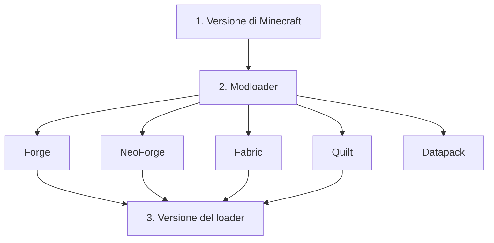
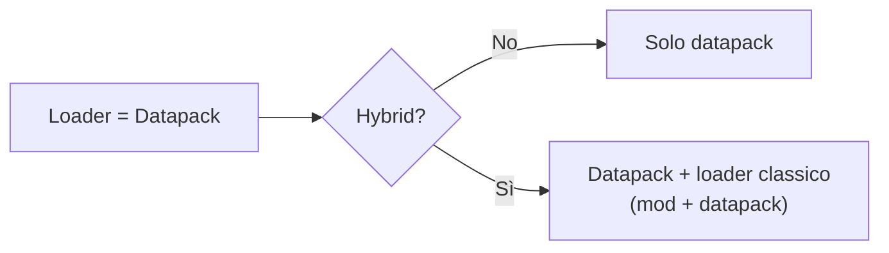

# 2 — Dashboard: dati del modpack

La **Dashboard** (l'icona Home nella barra laterale) è dove imposti le informazioni generali del
modpack: nome, versione del pack, il modloader e la versione di Minecraft, più le risorse aggiuntive
e le note.

## Dettagli (Details)

Compila i dati identificativi del pack:

- **Name** — il nome del modpack (è anche il nome del file di progetto salvato).
- **Version** — la versione del tuo pack (es. `1.0.0`).
- **Description** — una breve descrizione.

## Dipendenze (Dependencies): versione MC e modloader

Qui scegli su cosa gira il modpack:

1. **Versione di Minecraft** — scegli la versione MC dal menu (mostra solo le release).
2. **Modloader** — scegli tra Forge, NeoForge, Fabric, Quilt oppure **Datapack**.
3. **Versione del loader** — scegli la versione del modloader (l'elenco è filtrato in base alla
   versione MC scelta).

> Cambiando versione MC o tipo di loader, la versione del loader viene azzerata: dovrai riselezionarla
> (è una sicurezza, perché non tutte le versioni sono compatibili tra loro).

### Modpack a soli Datapack e modalità ibrida

Se scegli **Datapack** come loader, il pack dipende solo dalla versione di Minecraft (nessuna versione
di loader). Compare una spunta **Hybrid**:

- **Hybrid disattivato** — modpack di soli datapack.
- **Hybrid attivato** — modpack **misto**: mod *e* datapack. Scegli anche un loader classico
  (Forge/NeoForge/Fabric/Quilt) e la sua versione.

Puoi anche indicare la **cartella dei datapack** se non è quella predefinita (`datapacks/` dentro la
cartella di lavoro): usa il selettore di cartella. È utile perché la posizione dei datapack cambia a
seconda che siano lato client (per mondo) o lato server.

## Risorse (Assets)

Nella tabella **Assets** puoi elencare risorse extra del pack che non sono mod, ad esempio:

- Resource Pack, Shader Pack, Data Pack, Config, Icon, Splash, Other.

Per ogni risorsa indichi **tipo**, **nome**, **percorso** ed eventualmente un **link** (URL della
fonte). Puoi:

- **Aggiungere** una risorsa (pulsante Add).
- **Modificare** o **rimuovere** una risorsa dalla riga.
- Aprire il **link** della risorsa nel browser.
- Aggiungere **note** alla singola risorsa.

## Note del progetto

Puoi tenere delle **note libere** sul modpack (promemoria, TODO, appunti): aggiungile dall'apposito
pulsante e rimuovile quando non servono più. Vengono salvate nel progetto.

## Aggiornare le versioni disponibili

Se mancano versioni recenti nei menu a tendina, usa il pulsante di **aggiornamento** per riscaricare
gli elenchi delle versioni di Minecraft e dei modloader da internet. Normalmente non serve: l'app usa
una cache che si aggiorna da sola periodicamente.
