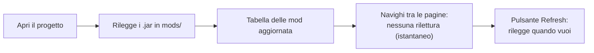
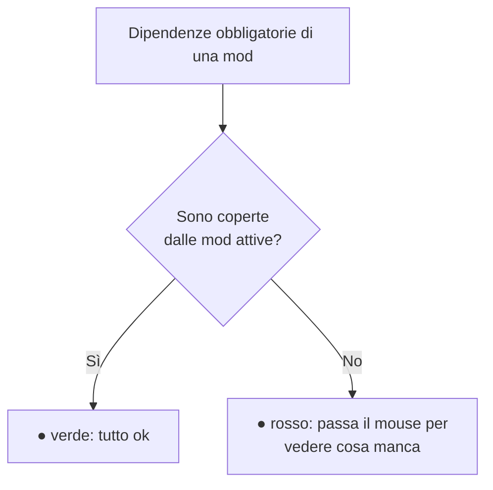
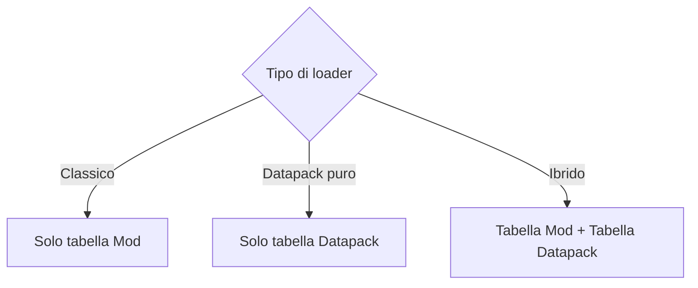

# 3 — Mod e datapack

La sezione **List Mods** (nella barra laterale) mostra cosa contiene davvero il tuo modpack: legge i
file `.jar` dalla cartella `mods` (e i datapack, se presenti) e li elenca con tutti i dettagli.

## Come funziona la scansione

**Ogni volta che apri un progetto** l'app rilegge la cartella `mods` e aggiorna la lista: nome,
versione, autori, modloader e dipendenze di ogni jar. Vale anche per i progetti già salvati, quindi se
tra una sessione e l'altra hai **aggiunto, aggiornato o cancellato** dei mod dalla cartella, l'elenco
si allinea da solo — i mod che non ci sono più spariscono dalla lista.

Dentro la stessa sessione la lista non viene riletta a ogni cambio di pagina (sarebbe inutilmente
lento su modpack grandi): se modifichi la cartella **mentre** l'app è aperta, usa **Refresh**.

> Mentre la scansione è in corso compare una **schermata di attesa** con un'animazione di caricamento:
> l'app resta ferma di proposito, perché cambiare progetto o pagina a metà lettura lascerebbe dati
> incoerenti. Sui modpack piccoli (o quando i dati sono già in cache) è così rapida che non la vedi.

> Quando l'elenco cambia, in alto a destra compare un avviso con quante mod sono state aggiunte,
> rimosse o aggiornate, e la barra di salvataggio ti ricorda di salvare il progetto. Se sul disco non
> è cambiato niente, non compare nulla.

Lo stesso vale per la lista dei **datapack**.

## La tabella delle mod

In alto trovi i riepiloghi: numero **totale**, mod **attive**, **non attive**, quelle con
**dipendenze mancanti** e quelle **con avvisi** di lettura.

La tabella mostra per ogni mod:

| Colonna | Significato |
|---------|-------------|
| **On** | Interruttore attiva/disattiva la mod |
| **Mod** | Nome della mod |
| **Version** | Versione |
| **Loader** | Forge / NeoForge / Fabric / Quilt (badge colorato) |
| **Format** | Da quale file sono stati letti i dati (vedi sotto) |
| **Authors** | Autori |
| **Dependencies** | Stato delle dipendenze (vedi sotto) |

### Attivare e disattivare le mod

L'interruttore **On** ti permette di marcare una mod come attiva o non attiva. È un modo per tenere
traccia di cosa fa parte del pack senza cancellare file. Lo stato viene salvato nel progetto.

### Cercare una mod

Usa la barra di **ricerca**: puoi digitare anche solo alcune lettere del nome (ricerca "fuzzy") e la
lista si ordina mostrando prima le corrispondenze migliori.

## Formato e avvisi di lettura

Ogni mod descrive se stessa in un file dentro il jar, e quel file **cambia in base alla versione di
Minecraft**. L'app riconosce tutti i formati e nella colonna **Format** ti dice quale ha usato:

| Badge | Da dove arrivano i dati |
|-------|-------------------------|
| `mods.toml` | Mod Forge/NeoForge da Minecraft 1.13 in poi |
| `mcmod.info` | Mod Forge **fino a 1.12.2** (formato vecchio) |
| `fabric.mod.json` / `quilt.mod.json` | Mod Fabric / Quilt |
| `MANIFEST.MF` | Nessun formato riconosciuto: dati ricavati dal manifest del jar |
| `non riconosciuto` | Il jar non contiene informazioni leggibili (resta solo il nome del file) |

Se accanto al badge compare un **triangolo giallo**, passaci il mouse: l'app spiega cosa non le è
tornato leggendo quel jar. I casi più comuni:

- il jar è di una **versione di Minecraft diversa** da quella impostata nella dashboard (tipico
  quando si copia un mod nella cartella sbagliata);
- il file di descrizione del mod è **malformato**: i dati sono stati recuperati alla meglio;
- il jar **non contiene testi in inglese**, quindi le sue keybind non sono rilevabili nella sezione
  Keybinds.

> La versione di Minecraft impostata nella dashboard fa parte di quello che l'app usa per capire il
> formato: se la cambi, alla prossima apertura di List Mods la scansione viene rifatta da zero.

## Dipendenze mancanti

La colonna **Dependencies** ti avvisa se a una mod manca qualcosa che le serve per funzionare:

- **Pallino verde** — tutte le dipendenze obbligatorie sono soddisfatte dalle altre mod attive.
- **Pallino rosso** — manca qualcosa: passa il mouse sopra per vedere l'elenco delle dipendenze
  mancanti.

Il controllo tiene conto anche delle dipendenze **incluse dentro** un altro jar (molte mod Forge
racchiudono le librerie di cui hanno bisogno), quindi riduce i falsi allarmi.

> 💡 Se apri un progetto vecchio e vedi molti falsi "manca dipendenza", premi **Refresh**: una nuova
> scansione riconosce meglio le librerie incluse.

## Datapack

Se il tuo modpack usa i **datapack** (loader Datapack, oppure modalità ibrida — vedi
[capitolo 2](./02-dashboard.md)), compare anche una tabella dedicata ai datapack, con:

| Colonna | Significato |
|---------|-------------|
| **On** | Attiva/disattiva il datapack |
| **Datapack** | Nome |
| **Pack format** | Formato del datapack |
| **Description** | Descrizione |

Cosa vedi in base al loader:

I datapack vengono letti dalla cartella dei datapack (predefinita `datapacks/`, o quella che hai
impostato nella Dashboard). Anche qui il pulsante **Refresh** rilegge la cartella.
