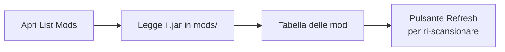
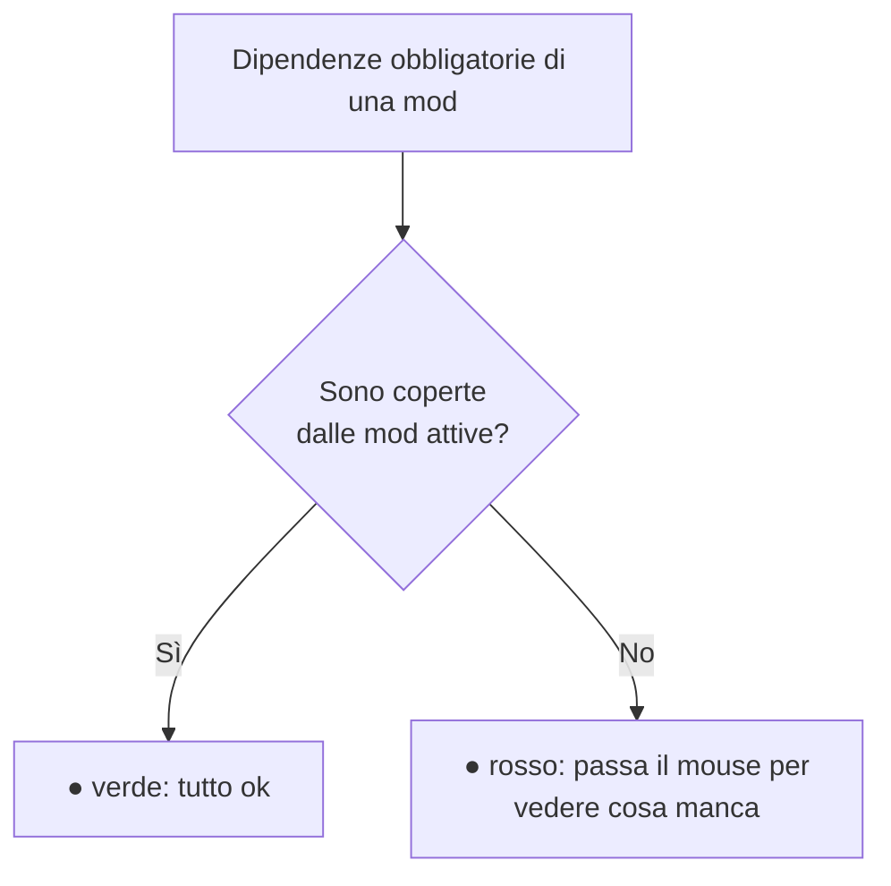
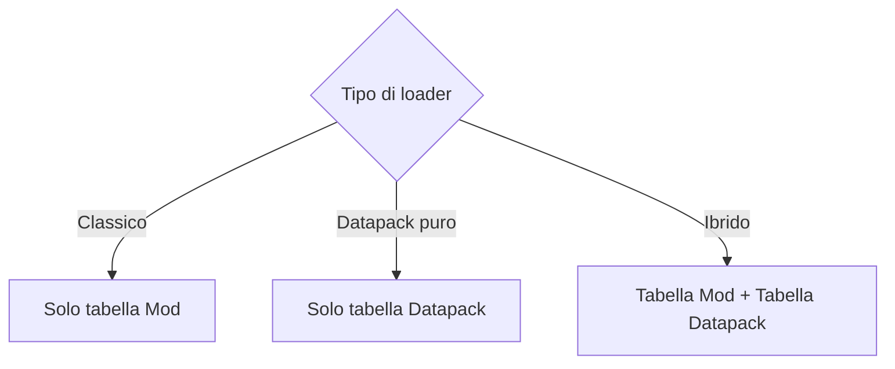

# 3 — Mod e datapack

La sezione **List Mods** (nella barra laterale) mostra cosa contiene davvero il tuo modpack: legge i
file `.jar` dalla cartella `mods` (e i datapack, se presenti) e li elenca con tutti i dettagli.

## Come funziona la scansione

La prima volta che apri la sezione, l'app **scansiona** la cartella `mods` e legge da ogni jar nome,
versione, autori, modloader e dipendenze. Il risultato viene ricordato, così le volte successive è
istantaneo.

> Usa **Refresh** quando aggiungi, aggiorni o rimuovi mod dalla cartella: aggiorna l'elenco leggendo di
> nuovo i file.

## La tabella delle mod

In alto trovi tre riepiloghi: numero **totale**, mod **attive** e **non attive**.

La tabella mostra per ogni mod:

| Colonna | Significato |
|---------|-------------|
| **On** | Interruttore attiva/disattiva la mod |
| **Mod** | Nome della mod |
| **Version** | Versione |
| **Loader** | Forge / NeoForge / Fabric / Quilt (badge colorato) |
| **Authors** | Autori |
| **Dependencies** | Stato delle dipendenze (vedi sotto) |

### Attivare e disattivare le mod

L'interruttore **On** ti permette di marcare una mod come attiva o non attiva. È un modo per tenere
traccia di cosa fa parte del pack senza cancellare file. Lo stato viene salvato nel progetto.

### Cercare una mod

Usa la barra di **ricerca**: puoi digitare anche solo alcune lettere del nome (ricerca "fuzzy") e la
lista si ordina mostrando prima le corrispondenze migliori.

## Dipendenze mancanti

La colonna **Dependencies** ti avvisa se a una mod manca qualcosa che le serve per funzionare:

- **Pallino verde** — tutte le dipendenze obbligatorie sono soddisfatte dalle altre mod attive.
- **Pallino rosso** — manca qualcosa: passa il mouse sopra per vedere l'elenco delle dipendenze
  mancanti.

Il controllo tiene conto anche delle dipendenze **incluse dentro** un altro jar (molte mod Forge
racchiudono le librerie di cui hanno bisogno), quindi riduce i falsi allarmi.

> 💡 Se apri un progetto vecchio e vedi molti falsi "manca dipendenza", premi **Refresh**: una nuova
> scansione riconosce meglio le librerie incluse.

## Datapack

Se il tuo modpack usa i **datapack** (loader Datapack, oppure modalità ibrida — vedi
[capitolo 2](./02-dashboard.md)), compare anche una tabella dedicata ai datapack, con:

| Colonna | Significato |
|---------|-------------|
| **On** | Attiva/disattiva il datapack |
| **Datapack** | Nome |
| **Pack format** | Formato del datapack |
| **Description** | Descrizione |

Cosa vedi in base al loader:

I datapack vengono letti dalla cartella dei datapack (predefinita `datapacks/`, o quella che hai
impostato nella Dashboard). Anche qui il pulsante **Refresh** rilegge la cartella.
