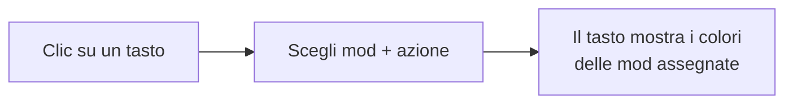
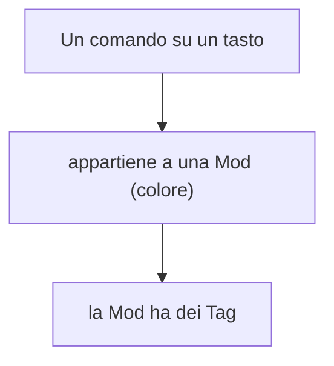
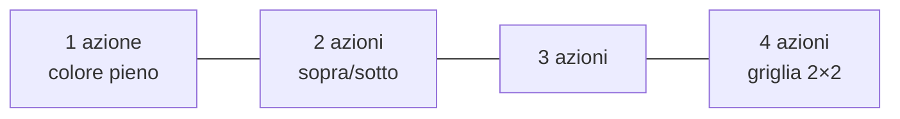

# 4 — Keybinds: mappare i tasti

La sezione **Keybinds** è un editor visuale della tastiera per organizzare i comandi (keybind) del
modpack: quale tasto fa quale azione, di quale mod, in quale "profilo".

## La tastiera

Al centro vedi una tastiera (layout italiano) con tastierino numerico e pulsanti del mouse. Ogni tasto
è cliccabile: cliccandolo assegni una o più azioni a quel tasto.

## Mappe (profili)

Puoi avere **più mappe**, cioè profili di keybind diversi (es. "Tech & Armi", "Magia"), ciascuno col
proprio set di tasti. In cima trovi il selettore delle mappe con i pulsanti per **aggiungere** e
**rimuovere** una mappa.

> Una nuova mappa parte già con i comandi **vanilla di Minecraft** (movimento, inventario, hotbar,
> ecc.) sui loro tasti predefiniti, così non parti da zero.

## Mod e Tag: organizzare i comandi

Ci sono due modi per classificare i comandi, usati anche come filtri:

- **Mod** — la categoria principale di un comando: la mod a cui appartiene (con un suo **colore**).
  Usa il pulsante **Add Mod** per aggiungere una mod (la scegli dall'elenco delle mod installate),
  darle un colore e associarle dei tag.
- **Tag** — un'etichetta secondaria (es. "Tecnologia", "Magia", "Movimento") per raggruppare i comandi
  trasversalmente. Usa **Add Tag** per crearne di nuovi.

## Assegnare un'azione a un tasto

1. Clicca il tasto.
2. Scegli la **mod** (categoria).
3. Scegli l'**azione**: per le mod riconosciute, un menu a tendina ti mostra le azioni reali di quella
   mod (ricercabili per nome). Per i comandi vanilla trovi le azioni standard di Minecraft. Se una mod
   non espone le sue azioni, puoi scrivere l'azione a mano.
4. Conferma.

> Puoi salvare l'assegnazione solo nella mappa corrente, oppure applicarla a **tutte le mappe** in una
> volta.

## Più azioni sullo stesso tasto

Un tasto può avere fino a **4** azioni diverse (di mod diverse). Lo sfondo del tasto si divide in
riquadri colorati, uno per mod:

Così, guardando la tastiera, capisci a colpo d'occhio quali tasti sono usati e da quali mod.

## Filtrare la vista

Le barre dei filtri **Mods** e **Tags**, più la ricerca testuale, ti aiutano a concentrarti: i tasti
che non rientrano nei filtri vengono attenuati (restano visibili ma in secondo piano).

## Macro (combinazioni con modificatore)

Oltre ai tasti singoli, puoi definire **macro**: combinazioni con un modificatore, tipo **Ctrl+A**,
**Shift+F**, **Alt+G**. Sono gestite a parte dal pulsante dedicato (scegli modificatore, tasto base,
mod e azione).

> ⚠️ Le macro non sono supportate dal formato `options.txt` di Minecraft: se esporti in quel formato
> vengono saltate e segnalate. Vedi [capitolo 5](./05-import-export-keybind.md).

## Salvataggio

Tutte le modifiche ai keybind (mappe, mod, tag, macro) fanno comparire la **barra di salvataggio** in
alto: clicca **Save** per conservarle nel progetto.

Per portare i tuoi keybind dentro Minecraft (o importarli da un file esistente), vedi il
[capitolo 5](./05-import-export-keybind.md).
