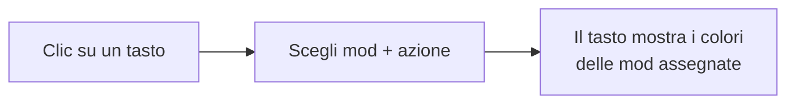
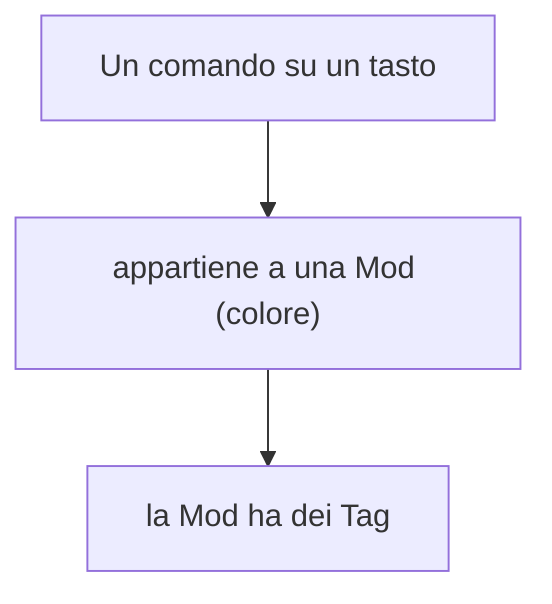
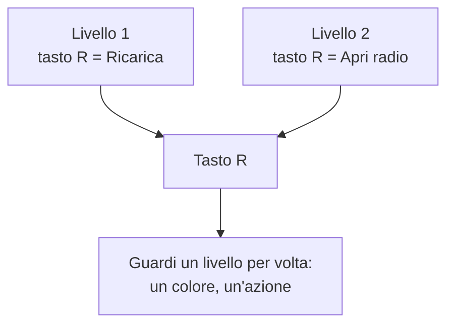

# 4 — Keybinds: mappare i tasti

La sezione **Keybinds** è un editor visuale della tastiera per organizzare i comandi (keybind) del
modpack: quale tasto fa quale azione, di quale mod, in quale "profilo".

## La tastiera

Al centro vedi una tastiera (layout italiano) con tastierino numerico e pulsanti del mouse. Ogni tasto
è cliccabile: cliccandolo assegni una o più azioni a quel tasto.

## Mappe (profili)

Puoi avere **più mappe**, cioè profili di keybind diversi (es. "Tech & Armi", "Magia"), ciascuno col
proprio set di tasti. In cima trovi il selettore delle mappe con i pulsanti per **aggiungere** e
**rimuovere** una mappa.

> Una nuova mappa parte già con i comandi **vanilla di Minecraft** (movimento, inventario, hotbar,
> ecc.) sui loro tasti predefiniti, così non parti da zero.

## Mod e Tag: organizzare i comandi

Ci sono due modi per classificare i comandi, usati anche come filtri:

- **Mod** — la categoria principale di un comando: la mod a cui appartiene (con un suo **colore**).
  Usa il pulsante **Add Mod** per aggiungere una mod (la scegli dall'elenco delle mod installate),
  darle un colore e associarle dei tag.
- **Tag** — un'etichetta secondaria (es. "Technology", "Magic", "Movement") per raggruppare i comandi
  trasversalmente. Un **elenco di tag tematici è già pronto** in ogni progetto nuovo, quindi puoi
  associarli alle mod da subito, anche prima di creare la prima mappa; con **Add Tag** ne aggiungi
  altri, e cliccando su un tag esistente lo rinomini o lo elimini.

## Assegnare un'azione a un tasto

1. Clicca il tasto.
2. Scegli la **mod** (categoria).
3. Scegli l'**azione**: per le mod riconosciute, un menu a tendina ti mostra le azioni reali di quella
   mod (ricercabili per nome). Per i comandi vanilla trovi le azioni standard di Minecraft. Se una mod
   non espone le sue azioni, puoi scrivere l'azione a mano.
4. Conferma.

> In cima all'elenco compaiono le azioni **lette direttamente dal codice della mod** (quindi sicuramente
> comandi da tastiera); più in basso quelle riconosciute dal solo nome della traduzione, dove può
> capitare qualche voce che in realtà non è un comando.

> Puoi salvare l'assegnazione solo nella mappa corrente, oppure applicarla a **tutte le mappe** in una
> volta.

## Più azioni sullo stesso tasto: i livelli

Un tasto può avere **più azioni** (non c'è un massimo), ma mostrarle tutte insieme riempirebbe la
tastiera di tasti a scacchi multicolore, illeggibili. Per questo ogni mappa ha dei **livelli**: pensali
come fogli trasparenti sovrapposti. Su ciascun livello un tasto porta **una sola azione**, quindi resta
di un colore pieno.

A sinistra della tastiera c'è la **lista dei livelli**, con quante azioni contiene ciascuno: clicca un
livello per vedere cosa c'è, oppure **Tutti i livelli** per vederli sovrapposti (in quel caso il tasto
torna a dividersi in riquadri).

> **L'angolo piegato** — se un tasto è usato anche su altri livelli, il suo angolo in alto a destra
> appare piegato, come la punta di un foglio che sta sotto: così sai che quel tasto ha altre funzioni
> anche se ora non le vedi. Passandoci sopra col mouse ti dice su quali livelli.

### Spostare un'azione su un altro livello

Clicca il tasto: nell'editor vedi l'elenco delle azioni assegnate, ognuna con un menu **Livello**.
Scegli il livello dal menu; l'ultima voce, **Nuovo livello**, ne crea uno in più e ci mette l'azione.
Puoi crearne quanti ti servono, anche dal pulsante **Aggiungi livello** nella lista a sinistra.

> Se metti due azioni sullo stesso livello l'app te lo dice: è permesso, ma su quel livello il tasto
> tornerà a dividersi in riquadri.

### Sistemare una mappa già piena

Se hai una mappa fatta prima dei livelli, tutte le azioni stanno sul livello 1 e i tasti risultano
divisi in riquadri. Il pulsante **Distribuisci sui livelli** (compare solo quando serve) sposta
automaticamente le azioni che condividono un tasto su livelli separati, una per livello.

Un livello si rimuove solo se è **vuoto**, e solo l'ultimo: così non rischi di buttare via azioni senza
accorgerti di cosa spariva. Per svuotarlo, spostane le azioni su un altro livello dal menu **Livello**.

> Importando un `keybindprofiles.json` i livelli vengono assegnati da soli: la prima azione di un tasto
> va sul livello 1, la seconda sul 2, e così via, senza scartare niente.

## Filtrare la vista

Le barre dei filtri elencano **solo le mod (e i tag) che questa mappa usa davvero**: se una mod non ha
nemmeno un tasto qui, filtrarla ti darebbe una tastiera vuota, quindi non compare. Cambiando mappa la
lista cambia con essa. I chip stanno su **due righe al massimo** e si scorrono in orizzontale (trackpad o
Shift+rotella); **Tutte** resta sempre a sinistra, fuori dallo scorrimento.

Le barre dei filtri **Mods** e **Tags**, più la ricerca testuale, ti aiutano a concentrarti. Appena
attivi un filtro la tastiera diventa la **vista dedicata** a ciò che hai scelto: su ogni tasto resta
solo l'azione che corrisponde (a colore pieno), tutto il resto torna vuoto come su una mappa nuova, e i
livelli si vedono tutti insieme. Così scegliendo una mod vedi la sua mappa e nient'altro, invece di una
tastiera piena dei colori di tutte le mod.

> Un tasto che ha altre azioni nascoste dal filtro conserva l'**angolo piegato** in alto a destra: il
> tooltip ti dice da quali mod è usato, così non lo riassegni credendolo libero. Anche le macro fuori
> filtro vengono nascoste, non attenuate.

## Macro (combinazioni con modificatore)

Oltre ai tasti singoli, puoi definire **macro**: combinazioni con un modificatore, tipo **Ctrl+A**,
**Shift+F**, **Alt+G**. Sono gestite a parte dal pulsante dedicato (scegli modificatore, tasto base,
mod e azione).

> ⚠️ Le macro non sono supportate dal formato `options.txt` di Minecraft: se esporti in quel formato
> vengono saltate e segnalate. Vedi [capitolo 5](./05-import-export-keybind.md).

## Salvataggio

Tutte le modifiche ai keybind (mappe, mod, tag, macro) fanno comparire la **barra di salvataggio** in
alto: clicca **Save** per conservarle nel progetto.

Per portare i tuoi keybind dentro Minecraft (o importarli da un file esistente), vedi il
[capitolo 5](./05-import-export-keybind.md).
