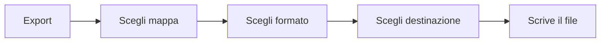
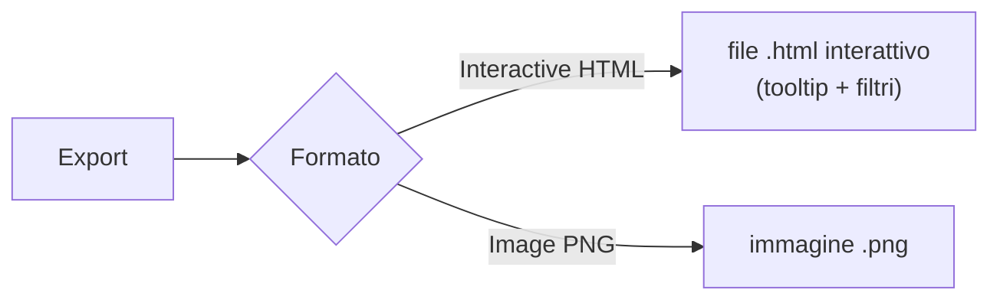
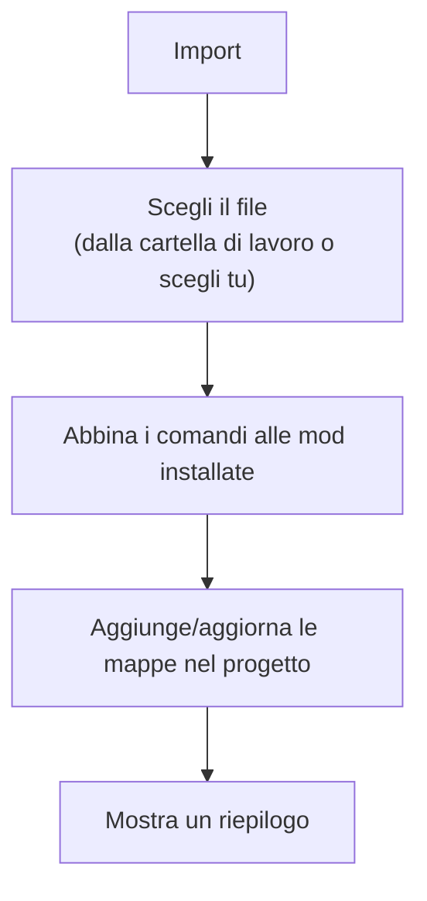

# 5 — Importare ed esportare i keybind

Dopo aver organizzato i keybind (vedi [capitolo 4](./04-keybinds.md)), puoi **esportarli** in un file
che Minecraft o le mod leggono, oppure **importare** keybind da un file già esistente.

## Esportare i keybind

Dalla barra delle mappe, il pulsante **Export** apre una finestra dove scegli:

1. **Quale mappa** esportare.
2. **Il formato** di destinazione.
3. **Dove salvare** il file (nella cartella di lavoro o in una posizione a tua scelta).

### Formato `options.txt` (Minecraft)

È il file delle opzioni di Minecraft, che contiene anche i tasti assegnati. L'export è **sicuro**:

- **Non tocca** le tue altre impostazioni (grafica, audio, ecc.): le lascia intatte.
- **Aggiorna** solo i tasti gestiti dal tuo progetto.
- **Non cancella** i tasti di mod che non stai gestendo.

Al termine, un messaggio ti dice quante righe sono state scritte ed eventuali **avvisi**, ad esempio:

- comandi senza una "chiave di traduzione" (non esportabili) → saltati;
- tasti non mappabili (es. alcuni tasti accentati italiani) → scritti come "sconosciuto";
- più tasti sulla stessa azione → viene tenuto l'ultimo;
- **macro** con modificatori → non supportate da `options.txt`, quindi saltate.

> Il formato **keyset** è previsto ma non ancora disponibile: appare disattivato nella lista dei
> formati.

### HTML interattivo e immagine della tastiera

Oltre ai file di config, puoi esportare la **rappresentazione grafica** della mappa dei tasti — utile
per condividerla o documentare il tuo modpack. Scegli il formato nel dialog **Export**:

- **Interactive HTML (keyboard view)** — genera un file `.html` autonomo con la tastiera colorata
  (un colore per mod). Aprilo in un browser: passando il mouse su un tasto vedi un'anteprima, e
  **cliccando su un tasto** si apre una finestra con l'elenco delle **azioni** e la **mod** di quel
  tasto. La legenda in alto permette di **filtrare** i tasti per mod o per tag. È di sola
  visualizzazione (non modifica il progetto) e funziona anche **offline**.
- **Image (PNG)** — genera un'**immagine** `.png` della tastiera, con in fondo la **legenda dei
  colori delle mod**, pronta da inserire in una guida, un post o un README.

Entrambi rispecchiano la mappa selezionata, con i colori delle mod e i tasti a più azioni suddivisi in
riquadri, esattamente come nella pagina Keybinds.

## Importare i keybind

Il pulsante **Import** legge un file di keybind esistente e ne ricostruisce le mappe dentro il
progetto.

Durante l'import, l'app:

- abbina ogni comando alla **mod installata** corrispondente (leggendo i tuoi jar);
- **scarta** i comandi di mod che non hai installato (e che non sono vanilla);
- ricostruisce le combinazioni con modificatore come **macro**.

### Il riepilogo dell'import

Al termine vedi una tabella con eventuali comandi **saltati** e il motivo:

| Motivo | Significato |
|--------|-------------|
| **not-installed** | La mod di quel comando non è tra quelle installate → scartato |
| **unmapped** | Il tasto non è rappresentabile sulla tastiera dell'app |
| **overflow** | Il tasto aveva già 4 comandi (il massimo) → non aggiunto |

I comandi "senza tasto" (non assegnati) vengono semplicemente ignorati, senza finire tra i problemi.

> Ricorda di **salvare** (barra di salvataggio) dopo un import per conservare le mappe importate nel
> progetto.
