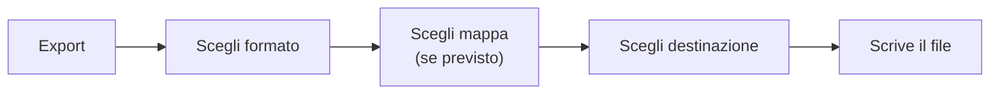
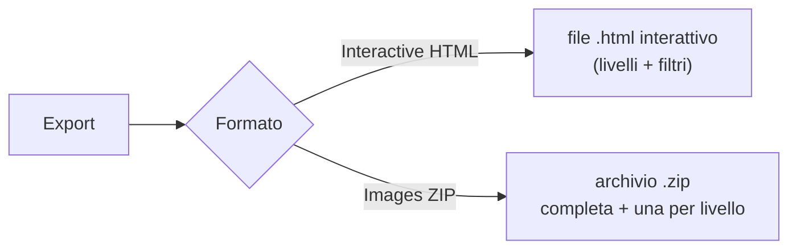
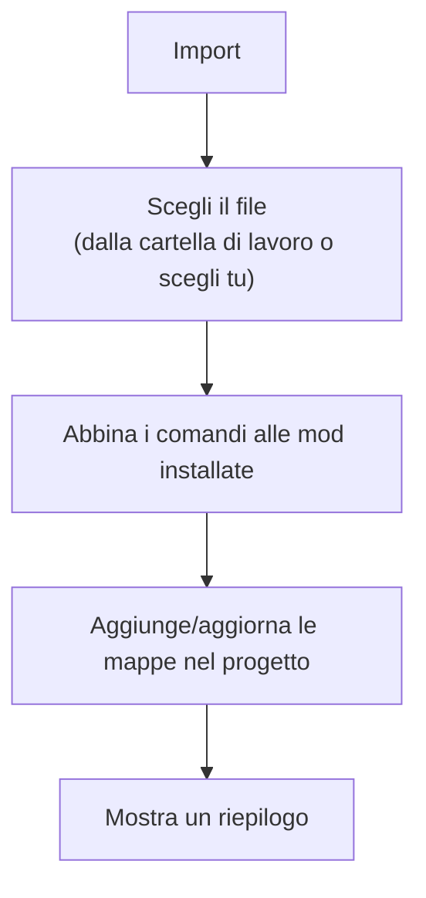

# 5 — Importare ed esportare i keybind

Dopo aver organizzato i keybind (vedi [capitolo 4](./04-keybinds.md)), puoi **esportarli** in un file
che Minecraft o le mod leggono, oppure **importare** keybind da un file già esistente.

## Esportare i keybind

Dalla barra delle mappe, il pulsante **Export** apre una finestra dove scegli:

1. **Il formato** di destinazione (si sceglie per primo).
2. **Quale mappa** esportare — appare solo se il formato lo prevede (vedi sotto).
3. **Dove salvare** il file (nella cartella di lavoro o in una posizione a tua scelta).

> La finestra **non si chiude** cliccando fuori: la configurazione ha più passaggi e un click di troppo
> a fianco te la faceva perdere. Per chiuderla usa la **X** in alto a destra o **Esc**.

A seconda del formato, la scelta della mappa cambia:

| Formato | Scelta mappa |
|---------|--------------|
| **Keyset** (`keybindprofiles.json`) | nessuna: esporta **tutte** le mappe insieme nell'unico file |
| **Minecraft `options.txt`** | una sola mappa |
| **HTML / Images (ZIP)** | una mappa, oppure **All** = un file per ogni mappa |

Con **All** (solo HTML/Images) puoi salvare i file nella cartella di lavoro o scegliere una **cartella**
di destinazione.

### Formato `options.txt` (Minecraft)

È il file delle opzioni di Minecraft, che contiene anche i tasti assegnati. L'export è **sicuro**:

- **Non tocca** le tue altre impostazioni (grafica, audio, ecc.): le lascia intatte.
- **Aggiorna** solo i tasti gestiti dal tuo progetto.
- **Non cancella** i tasti di mod che non stai gestendo.

Al termine, un messaggio ti dice quante righe sono state scritte ed eventuali **avvisi**, ad esempio:

- comandi senza una "chiave di traduzione" (non esportabili) → saltati;
- tasti non mappabili (es. alcuni tasti accentati italiani) → scritti come "sconosciuto";
- più tasti sulla stessa azione → viene tenuto l'ultimo;
- **macro** con modificatori → non supportate da `options.txt`, quindi saltate.

### Formato `keyset` (mod Keyset)

Genera l'unico file `config/keybindprofiles.json` della mod
[Keyset](https://github.com/BeeBoyD/Keyset): **ogni mappa diventa un profilo** all'interno dello stesso
file, quindi non devi scegliere quale mappa esportare — vengono incluse **tutte**. L'export **rispetta
i profili già presenti** (es. quelli creati direttamente nel gioco): aggiorna solo quelli con lo stesso
nome delle tue mappe e lascia intatti gli altri. I tasti non mappabili vengono esportati come "non
assegnati". A differenza di `options.txt`, qui le **macro** (tasto + modificatore) sono supportate.

### HTML interattivo e immagine della tastiera

Oltre ai file di config, puoi esportare la **rappresentazione grafica** della mappa dei tasti — utile
per condividerla o documentare il tuo modpack. Scegli il formato nel dialog **Export**:

- **Interactive HTML (keyboard view)** — genera un file `.html` autonomo con la tastiera colorata
  (un colore per mod). Aprilo in un browser: passando il mouse su un tasto vedi un'anteprima, e
  **cliccando su un tasto** si apre una finestra con l'elenco delle **azioni** e la **mod** di quel
  tasto. La legenda in alto permette di **filtrare** i tasti per mod o per tag. È di sola
  visualizzazione (non modifica il progetto) e funziona anche **offline**.
- **Images (ZIP of PNG)** — genera un archivio `.zip` con le immagini della tastiera, pronte da
  inserire in una guida, un post o un README. Dentro trovi una **cartella col nome della mappa** e:

  | File | Cosa mostra |
  |------|-------------|
  | `complete.png` | la mappa **intera**, tutti i livelli insieme (i tasti condivisi restano divisi in riquadri) |
  | `layer-1.png`, `layer-2.png`, … | **un'immagine per livello**: su ogni tasto una sola azione, a colore pieno |

  Ogni immagine ha in alto il nome della mappa e il livello, e in fondo la **legenda dei colori delle
  mod**. Se la mappa ha un livello solo l'archivio contiene la sola `complete.png` (le altre sarebbero
  la stessa immagine).

Entrambi rispecchiano la mappa selezionata coi colori delle mod, esattamente come nella pagina
Keybinds — livelli compresi.

## Importare i keybind

Il pulsante **Import** legge un file di keybind esistente e ne ricostruisce le mappe dentro il
progetto.

Durante l'import, l'app:

- abbina ogni comando alla **mod installata** corrispondente (leggendo i tuoi jar);
- **scarta** i comandi di mod che non hai installato (e che non sono vanilla);
- ricostruisce le combinazioni con modificatore come **macro**.

### Il riepilogo dell'import

Al termine vedi una tabella con eventuali comandi **saltati** e il motivo:

| Motivo | Significato |
|--------|-------------|
| **not-installed** | La mod di quel comando non è tra quelle installate → scartato |
| **unmapped** | Il tasto non è rappresentabile sulla tastiera dell'app |

I comandi "senza tasto" (non assegnati) vengono semplicemente ignorati, senza finire tra i problemi.

> Ricorda di **salvare** (barra di salvataggio) dopo un import per conservare le mappe importate nel
> progetto.
