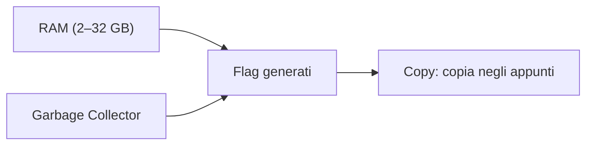

# 6 — Memoria e prestazioni (JVM)

La sezione **JVM** ti aiuta a preparare i parametri di avvio di Minecraft legati a **memoria** e
**prestazioni**. L'app genera per te la lista di "flag" pronti da incollare nel tuo launcher.

> L'app **non avvia** Minecraft: qui prepari solo i parametri, poi li copi dove ti servono (es. nelle
> impostazioni del launcher).

## Impostazioni

- **RAM** — quanta memoria assegnare al gioco, con uno slider da 2 a 32 GB. Imposta un valore
  adeguato al tuo pack (più mod = più memoria).
- **Garbage Collector** — il sistema di gestione memoria della Java Virtual Machine. Puoi scegliere:

| Opzione | Quando usarlo |
|---------|---------------|
| **G1GC (Aikar)** | Scelta consigliata e più diffusa per i server/modpack |
| **ZGC** | Alternativa moderna a bassa latenza |
| **Shenandoah** | Altra alternativa a bassa latenza |

## I flag generati

Sotto le impostazioni compare la lista dei **flag** corrispondenti (colorati per leggerli meglio),
già completi di memoria minima/massima e delle opzioni del garbage collector scelto. Alcuni valori si
adattano automaticamente quando assegni molta RAM (12 GB o più).

## Copiare i flag

Il pulsante **Copy** copia tutti i flag negli appunti: incollali nella configurazione del tuo launcher
(campo "argomenti JVM" o simile). Un messaggio ti conferma l'avvenuta copia.

> Le impostazioni (RAM e garbage collector) vengono salvate nel progetto: la barra di salvataggio
> comparirà quando le modifichi.
