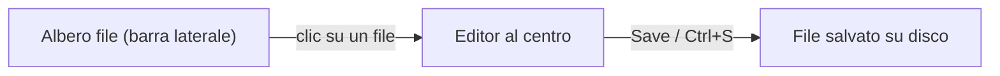
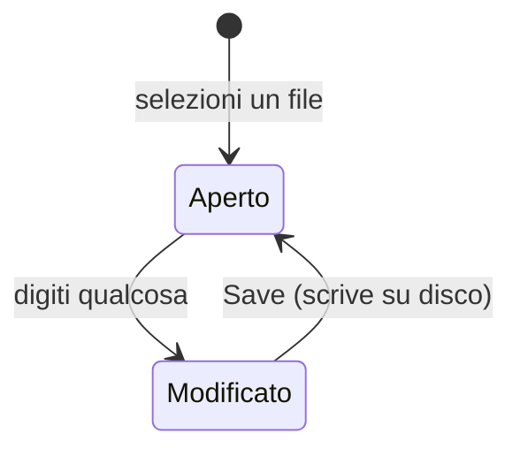

# 7 — Documenti: modificare i file di config

La sezione **Documenti** è un editor di testo/codice integrato per modificare i file di configurazione
del modpack (le cartelle `config` e `kubejs`) senza uscire dall'app.

## L'albero dei file

Nella barra laterale trovi l'**albero dei file** delle cartelle `config` e `kubejs` della tua cartella
di lavoro. Cartelle prima, poi file, in ordine alfabetico.

Dall'albero puoi anche:

- **Creare** un nuovo file (pulsante "+" su una cartella).
- **Rinominare** un file.
- **Eliminare** un file (con richiesta di conferma).
- **Aggiornare** l'albero (pulsante Refresh) se cambi i file dall'esterno.

## L'editor

Cliccando un file, si apre al centro nell'editor di codice. L'editor:

- **Riconosce il linguaggio** dall'estensione (JSON, TOML/config, JavaScript/KubeJS, ecc.) e colora la
  sintassi di conseguenza.
- Mostra in basso una **barra di stato** con: righe totali, posizione del cursore, tipo di file e — per
  i formati che lo supportano (es. JSON) — se il contenuto è **valido** o contiene errori.
- Evidenzia le **righe modificate** rispetto al file salvato (indicatori a margine + conteggio
  aggiunte/modifiche/rimozioni).

## Salvare un file

Le modifiche restano "in bozza" finché non salvi:

- Clicca **Save**, oppure premi **Ctrl/Cmd + S**.
- Finché ci sono modifiche non salvate, vedi l'indicatore **● unsaved** accanto al nome del file.

> **Importante**: il salvataggio dei file di configurazione è **indipendente** dal salvataggio del
> progetto. La barra di salvataggio generale (in alto) riguarda il file di progetto `.json`; i file di
> config si salvano dal loro editor con Save/Ctrl+S. Se provi a cambiare file con modifiche non salvate,
> l'app ti chiede conferma.
