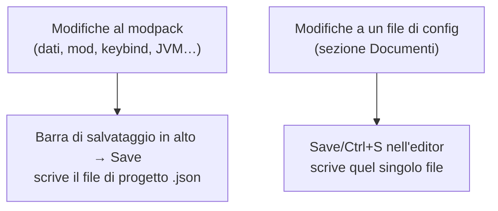
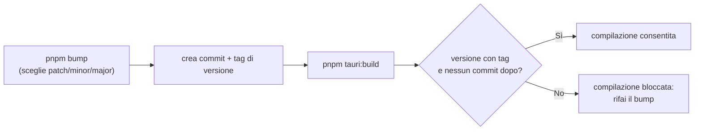

# 8 — Salvataggio e versioni

## Due tipi di salvataggio

Nell'app ci sono **due** salvataggi distinti, che è bene non confondere:

| Cosa modifichi | Come si salva |
|----------------|---------------|
| Dati del pack, mod/datapack attivi, keybind, impostazioni JVM, note, risorse | **Barra di salvataggio** in alto → `Save` (scrive `<nome>.json`) |
| Un file dentro `config`/`kubejs` (sezione Documenti) | **Save** o **Ctrl/Cmd+S** dentro l'editor |

## La barra di salvataggio

Quando modifichi qualcosa che riguarda il progetto, in alto compare una barra che ti ricorda di
salvare. Clicca **Save** per scrivere tutto nel file `.json` dentro la cartella di lavoro. Dopo il
salvataggio la barra scompare.

> Se il progetto non ha un nome, il salvataggio te lo segnala: imposta il **Name** nella Dashboard
> ([capitolo 2](./02-dashboard.md)).

## Salva con nome / cambia cartella

Dal menu **File**:

- **Save As** — salva il progetto in una nuova posizione o con un altro nome (la cartella di lavoro si
  aggiorna di conseguenza).
- **Change Workspace** — cambia la cartella di lavoro del progetto corrente.

In caso di modifiche non salvate, l'app chiede sempre conferma prima di operazioni che potrebbero far
perdere il lavoro (chiudere, aprirne un altro, uscire).

## Versioni dell'applicazione

> Questa parte interessa soprattutto chi **compila** l'app da sé; l'utente normale non deve farci nulla.

L'app tiene la propria versione allineata in più file e usa un piccolo "cancello" che **impedisce di
compilare** una versione non aggiornata:

In pratica, prima di generare l'eseguibile si esegue `pnpm bump` per incrementare la versione; senza
questo passaggio la build viene bloccata. I dettagli tecnici sono nella
[documentazione tecnica](../tecnica/12-versioning-build.md).

## Controllo degli aggiornamenti

All'avvio l'app controlla su GitHub se è uscita una versione più recente di Forge Modpack. Se c'è,
compare una finestra con la versione attuale, quella nuova e le novità del rilascio; il bottone
**Scarica** apre la pagina di download nel browser. L'app **non si aggiorna da sola**: l'installer va
scaricato e lanciato a mano.

Se non c'è nulla di nuovo (o manca la connessione) l'avvio non mostra nessuna finestra: il controllo
resta silenzioso e l'app funziona normalmente anche offline.

Puoi controllare in qualsiasi momento dal menu **Forge Modpack** (in cima alla barra laterale) →
**Controlla aggiornamenti**. Quando un aggiornamento è disponibile, accanto al nome dell'app compare
un pallino e la voce di menu mostra il numero della nuova versione.

Nella finestra c'è la casella **Includi le versioni beta (pre-release)**:

- **disattivata** (predefinito): vengono proposte solo le versioni stabili;
- **attivata**: vengono proposte anche le pre-release, cioè le versioni di prova pubblicate prima di
  una stabile — più aggiornate, ma potenzialmente meno collaudate.

La scelta viene ricordata per le volte successive.
