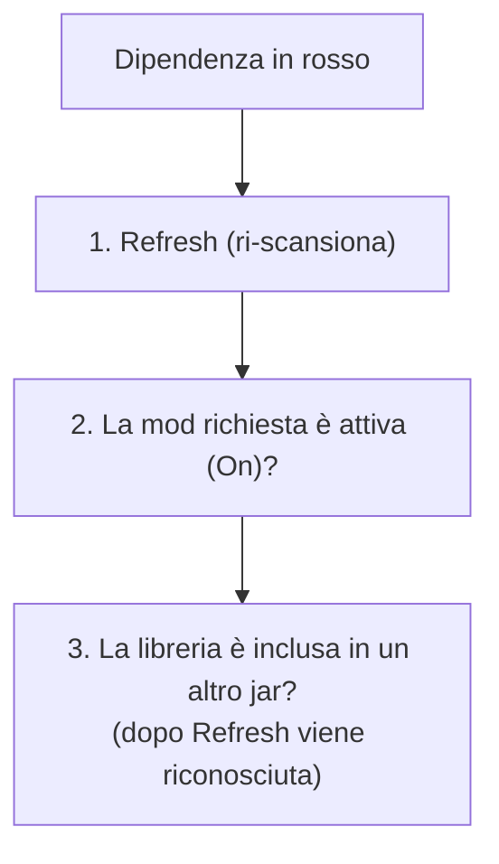

# 9 — FAQ e risoluzione problemi

Domande frequenti e soluzioni ai problemi più comuni. Se non trovi risposta qui, controlla il
capitolo dedicato alla funzione che stai usando.

## Progetto e avvio

### Vedo "No project selected"
Non c'è un progetto aperto. Clicca **Create** per iniziarne uno nuovo (scegli la cartella del
modpack) o **Open** per aprire un file di progetto `.json` esistente. Vedi
[capitolo 1](./01-primi-passi.md).

### Ho chiuso l'app: le mie modifiche ci sono ancora?
Solo se avevi **salvato**. Quando ci sono modifiche non salvate compare la barra di salvataggio in
alto: clicca **Save**. Ricorda che i file di configurazione (sezione Documenti) si salvano a parte,
dal loro editor. Vedi [capitolo 8](./08-salvataggio-e-versioni.md).

## Mod e datapack

### Non vedo le mie mod / la lista è vuota
1. Verifica che le mod (`.jar`) siano nella sottocartella **`mods`** della cartella di lavoro.
2. Premi **Refresh** in List Mods per rileggere la cartella.
3. Se il messaggio dice che la cartella non è stata trovata, controlla di aver scelto la cartella di
   lavoro giusta (menu File → *Change Workspace*).

### Ho aggiunto/aggiornato una mod ma non compare
L'elenco è "in cache" per velocità. Premi **Refresh** per forzare una nuova scansione della cartella
`mods`.

### Le dipendenze sono in rosso ma il gioco parte lo stesso
Può capitare con progetti creati con versioni precedenti dell'app o dopo modifiche alla cartella:

- Premi **Refresh** in List Mods. La nuova scansione riconosce anche le **librerie incluse dentro**
  altri jar (comune su Forge), riducendo i falsi allarmi.
- Ricorda che il controllo confronta le dipendenze **obbligatorie** con le mod **attive**: se hai
  disattivato una mod che ne soddisfa un'altra, comparirà in rosso.

### I miei datapack non compaiono
- I datapack si vedono solo se il loader è **Datapack** o se hai attivato la modalità **Hybrid**
  (vedi [capitolo 2](./02-dashboard.md)).
- Controlla la **cartella dei datapack**: di default è `datapacks/` nella cartella di lavoro, ma puoi
  averne impostata un'altra nella Dashboard.
- Premi **Refresh**.

## Keybinds

### Alcune azioni di una mod non compaiono nel menu
L'app legge le azioni dai file di lingua interni ai jar. Alcune mod usano nomi non standard e non
vengono riconosciute dalla scansione automatica: in quei casi puoi **scrivere l'azione a mano** nel
dialog del tasto. Molte di queste vengono comunque recuperate durante l'**import** di un file di
keybind esistente.

### Non riesco ad assegnare una quinta azione a un tasto
Il limite è **4 azioni per tasto**. Rimuovi un'azione esistente o usane un altro.

### Ho creato una nuova mappa e ci sono già dei comandi
È voluto: ogni nuova mappa parte con i comandi **vanilla di Minecraft** sui tasti predefiniti, così
non parti da una tastiera vuota. Puoi modificarli o rimuoverli.

## Esportazione e importazione

### I tasti accentati italiani (à, è, ì, ò, ù) non vengono esportati
Il formato `options.txt` di Minecraft **non** ha un codice stabile per i tasti accentati e per alcuni
simboli non presenti sulle tastiere US: questi tasti vengono scritti come "sconosciuto" e segnalati tra
gli avvisi. Se ti serve quel comando, assegnalo a un tasto standard (lettere, numeri, funzione,
tastierino).

### Le mie macro (Ctrl+…, Shift+…) non sono nell'export
Il formato `options.txt` **non** supporta le combinazioni con modificatore: le macro vengono saltate e
segnalate. Restano comunque salvate nel progetto. Vedi [capitolo 5](./05-import-export-keybind.md).

### Durante l'import alcuni comandi sono stati saltati
Al termine dell'import vedi un riepilogo con il motivo:

| Motivo | Cosa significa |
|--------|----------------|
| **not-installed** | La mod di quel comando non è installata → scartato |
| **unmapped** | Il tasto non è rappresentabile sulla tastiera dell'app |

I comandi non assegnati a nessun tasto vengono ignorati e non compaiono nel riepilogo.

### L'export ha sovrascritto le mie impostazioni di gioco?
No. L'export su `options.txt` è conservativo: modifica **solo** le righe dei tasti gestiti dal tuo
progetto e lascia intatte grafica, audio e i tasti di mod non gestite.

## Versioni e internet

### I menu delle versioni (MC / modloader) sono vuoti o vecchi
Gli elenchi si scaricano da internet e poi restano in cache. Alla prima apertura serve la
connessione; in seguito l'app funziona anche offline. Usa il pulsante di **aggiornamento** nella
Dashboard per riscaricare gli elenchi.

### La compilazione dell'app è bloccata
Riguarda solo chi **compila** l'app: prima della build va eseguito `pnpm bump` per generare una nuova
versione. È un comportamento voluto. Dettagli nella
[documentazione tecnica](../tecnica/12-versioning-build.md).

## Salvataggio

### Perché ci sono due salvataggi diversi?
Uno riguarda il **progetto** (dati del pack, mod, keybind, JVM…): si salva dalla barra in alto e
scrive il file `.json`. L'altro riguarda i **file di configurazione** aperti nella sezione Documenti:
si salvano dal loro editor con **Save** / **Ctrl/Cmd+S**. Sono indipendenti. Vedi
[capitolo 8](./08-salvataggio-e-versioni.md).
