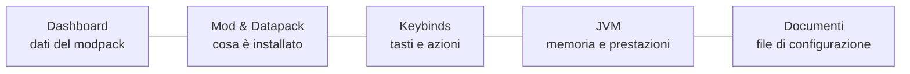

# ForgeModpack V2 — Guida d'uso

Guida pratica all'uso di **ForgeModpack V2**, l'app desktop per gestire mod, datapack, keybind e
impostazioni di un modpack Minecraft già presente sul tuo computer.

> **In breve**: scegli la cartella di un modpack, l'app legge cosa contiene e ti permette di
> organizzare mod e datapack, mappare i tasti, impostare la memoria di gioco e modificare i file di
> configurazione — il tutto salvato in un unico file di progetto. **L'app non scarica i mod e non
> avvia Minecraft**: è un organizzatore/editor.

## A chi è rivolta

A chi crea o mantiene un modpack e vuole tenere sotto controllo dipendenze, keybind e configurazioni
senza modificare file a mano uno per uno.

## Indice

| # | Capitolo | Cosa imparerai |
|---|----------|----------------|
| 1 | [Primi passi](./01-primi-passi.md) | Aprire/creare un progetto, la cartella di lavoro, salvare |
| 2 | [Dashboard: dati del modpack](./02-dashboard.md) | Nome/versione, modloader e versioni, datapack/ibrido, risorse, note |
| 3 | [Mod e datapack](./03-mods-e-datapack.md) | Elenco, attiva/disattiva, ricerca, dipendenze mancanti |
| 4 | [Keybinds: mappare i tasti](./04-keybinds.md) | Tastiera, mappe, mod e tag, più azioni per tasto, macro |
| 5 | [Importare ed esportare i keybind](./05-import-export-keybind.md) | Scrivere `options.txt`, importare profili |
| 6 | [Memoria e prestazioni (JVM)](./06-jvm.md) | RAM e garbage collector, copiare i flag |
| 7 | [Documenti: modificare i file di config](./07-documenti.md) | Editor di codice, alberi file, salvataggio |
| 8 | [Salvataggio e versioni](./08-salvataggio-e-versioni.md) | Barra di salvataggio, salva/salva con nome, versioni |
| 9 | [FAQ e risoluzione problemi](./09-faq.md) | Mod che non compaiono, dipendenze in rosso, tasti accentati, macro… |

## Mappa dell'app

A queste sezioni si accede dalla barra laterale a sinistra. In alto compare il nome del modpack
aperto; una barra di salvataggio appare automaticamente quando ci sono modifiche da salvare.

> 💡 La documentazione tecnica (per sviluppatori) è in [`docs/it/tecnica/`](../tecnica/README.md).
